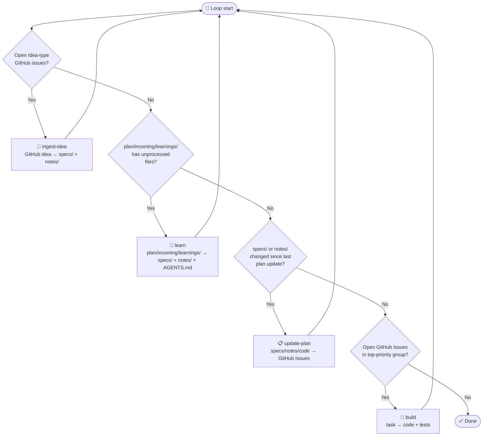

# Agentic Development Workflow

This project uses a four-skill pipeline for AI-assisted development. Each
skill has a clearly bounded scope, well-defined inputs and outputs, and a
defined place in a **priority-interrupt loop** that governs execution order.

The pipeline is designed to be automatable: an orchestrating agent can inspect
file-change signals to decide which skill to run next, always resolving
higher-priority steps before lower-priority ones.

---

## The Four Skills

### 1. `ingest-idea` — Design

**Purpose**: Convert raw human ideas into durable specifications and design
notes.

| | |
|---|---|
| **Trigger** | Open Idea-type GitHub issues exist (unprocessed) |
| **Input** | GitHub Idea-type issue (one idea per run) |
| **Process** | Select idea → explore codebase → grill-me interview → write |
| **Output** | `specs/<topic>.yaml` (new/updated), `notes/<topic>.md` |
| **Side effects** | Idea archived via `uv run append-history idea`; idea issue closed with links to PR and implementation issue; `specs/README.md` updated |

This is the **highest-priority** skill because new ideas may invalidate
in-progress plans or render planned tasks obsolete. Unprocessed Idea-type
issues should always be ingested before any other work proceeds.

---

### 2. `learn` — Integrate Build Lessons

**Purpose**: Promote lessons learned during build execution into durable
specifications, design notes, and agent guidance.

| | |
|---|---|
| **Trigger** | `plan/incoming/learnings/` has unprocessed files |
| **Input** | `plan/incoming/learnings/` (individual per-entry files) |
| **Process** | Load context → analyze gaps → grill-me interview → write |
| **Output** | `specs/` (refined), `notes/` (promoted), `AGENTS.md` (updated) |
| **Side effects** | Processed files moved to `plan/history/YYMM/learning/` via `uv run append-history --from-file` |

`learn` is the **second-priority** skill. Build execution produces insights
that should be reflected in specs before the plan is updated. Running
`update-plan` on stale specs would produce a plan misaligned with what the
codebase actually needs.

> For ideas originating outside the build process (human brainstorming,
> external research), use `ingest-idea` instead.

---

### 3. `update-plan` — Plan Maintenance

**Purpose**: Perform a gap analysis between current specs/notes and the
codebase, then create GitHub Issues for any untracked gaps.

| | |
|---|---|
| **Trigger** | `specs/` or `notes/` have changed since the last plan update |
| **Input** | `specs/`, `notes/`, `vultron/`, `test/`, Project #24 board, open GitHub Issues |
| **Process** | Load context → gap analysis → create GitHub Issues → add to board → write observations to `notes/` |
| **Output** | New GitHub Issues (added to Project #24 with Schedule=Someday), updated `notes/` |
| **Side effects** | None — does not commit code or close issues |

`update-plan` is the **third-priority** skill. It translates the current
specs and notes into concrete GitHub Issues. Running `build` without a
gap analysis risks implementing the wrong things or duplicating
already-completed work.

---

### 4. `build` — Execute

**Purpose**: Complete the highest-priority pending task from GitHub Issues.

| | |
|---|---|
| **Trigger** | Open GitHub Issues exist in the top-priority group and no higher-priority skill is triggered |
| **Input** | Top-priority open GitHub Issue, `specs/`, `notes/` |
| **Process** | Select task → claim branch → implement → validate → open PR |
| **Output** | `vultron/` (code), `test/` (tests), GitHub PR |
| **Side effects** | Summary archived via `uv run append-history implementation`; observations recorded as individual files in `plan/incoming/learnings/` (triggering `learn` on the next loop) |

`build` is the **lowest-priority** skill — it only runs when no higher-level
skill is triggered. Its side effects (new files in `plan/incoming/learnings/`)
naturally trigger `learn` on the next loop iteration.

---

## Priority-Interrupt Loop

The pipeline runs as a loop. On each iteration, the agent checks trigger
conditions in priority order and runs the first matching skill. After the
skill completes, the loop restarts — higher-priority skills always preempt
lower-priority ones.



---

## File Roles in the Pipeline

| File | Role | Ephemeral? |
|---|---|---|
| GitHub Idea-type issues | Raw human ideas awaiting ingestion | Yes — processed and closed by `ingest-idea` |
| `plan/history/` | Archive of processed ideas, tasks, learnings | Permanent (append-only, chunked) |
| `specs/*.yaml` | Authoritative requirements | Permanent |
| `notes/*.md` | Durable design insights | Permanent |
| `AGENTS.md` | Agent conventions and patterns | Permanent |
| GitHub Project #24 | Authoritative priority scheduling (Now/Next/Later/Someday) | Live — updated via API |
| GitHub Task/Subtask Issues | Pending + in-progress tasks | Yes — closed when PR merges |
| `plan/incoming/learnings/` | Ephemeral build/bugfix observations (individual files) | Yes — files moved to history by `learn` |
| `vultron/`, `test/` | Implementation | Permanent |

---

## Incoming Learnings Queue Content Policy

`plan/incoming/learnings/` is the **exclusive upstream channel** from
code-executing skills (`build`, `bugfix`) to the `learn` skill.

Each observation is recorded as an individual file (`YYYYMMDD-SLUG.md`) with
YAML frontmatter matching the history entry format. Using individual files
instead of a shared flat file eliminates merge conflicts when multiple PRs
each have an observation to record.

### What belongs here

- Observations about unclear or missing spec requirements discovered during
  implementation (e.g., "The specs don't say what to do when X")
- Constraints or invariants discovered in the code that aren't documented
- Open questions raised during implementation that need a decision
- Patterns that keep recurring and should become `AGENTS.md` guidance
- Gotchas or pitfalls encountered that should be preserved for future runs

### What does NOT belong here

- Completion summaries ("Task X is done") → use `uv run append-history implementation`
- Status updates ("I completed Y and Z") → use `uv run append-history implementation`
- Documentation of finished work → use `append-history` or `notes/`
- `update-plan` gap-analysis observations → write directly to `notes/*.md`

### File format

```yaml
---
title: "Short observation title"
type: learning
timestamp: 'YYYY-MM-DDTHH:MM:SS+00:00'
source: YYYYMMDD-SLUG
---

Observation body text.
```

### Lifecycle

```text
build/bugfix run
  → creates plan/incoming/learnings/YYYYMMDD-SLUG.md (committed in the PR)

learn run
  → each file promoted to specs/*.yaml, notes/*.md, or AGENTS.md
  → promotion note appended to file body
  → uv run append-history --from-file <path>  ← moves file to history, deletes source

After learn completes:
  plan/incoming/learnings/ contains only .gitkeep (ideally empty)
  plan/history/YYMM/learning/*.md contains the archived originals
```

See `specs/build-workflow.yaml` (BW-01 through BW-06) for the normative
requirements.

---

## Feedback Loops

The pipeline has two natural feedback loops:

1. **Build → Learn**: `build` and `bugfix` create individual learning files in
   `plan/incoming/learnings/`. On the next loop, `learn` promotes each file's
   observations to specs, notes, and `AGENTS.md`, archives each entry via
   `uv run append-history --from-file`, and the file moves to history.
   This ensures what the codebase teaches us is captured durably before the
   plan is next updated.

2. **Learn/Ingest → Update-plan**: After `learn` or `ingest-idea` refines
   specs and notes, `update-plan` picks up the changes and translates them
   into concrete tasks. This keeps the plan aligned with the current
   specification reality.

---

## Design Decisions

| Question | Decision | Rationale |
|---|---|---|
| Why separate `ingest-idea` from `learn`? | External ideas and internal build lessons are different sources with different quality gates | Ideas need a grill-me interview; build lessons are already structured enough to promote directly |
| Why is `update-plan` distinct from `build`? | Plan maintenance is a research task; execution is a coding task | Mixing them produces plans that drift from specs |
| Why restart the loop after each skill? | Higher-priority skills may be triggered by a lower-priority skill's outputs | Ensures design always precedes planning, planning always precedes building |
| Why no branching inside skills? | Clean boundaries enable future automation of the loop | A BT or script can inspect file-change signals to trigger the right skill |
| Why rename `IMPLEMENTATION_NOTES.md` to `BUILD_LEARNINGS.md`? | The old name implied general design notes; the new name signals a specific, focused role: a queue of code-execution observations for `learn` to promote | See `specs/build-workflow.yaml` BW-01-001 |
| Why not let `build` write directly to `notes/`? | `build`'s job is coding; documentation curation is `learn`'s domain. `BUILD_LEARNINGS.md` is the upstream channel for `build` to communicate observations; `learn` decides what to do with them | BW-01-001, BW-01-002 |
| Why delete (not strike-through) processed learnings? | `BUILD_LEARNINGS.md` is a queue, not an archive. Processed entries live in `plan/history/` via `append-history learning`. Keeping the queue clean prevents accumulation of stale noise | BW-02-002 |

---

## Future Automation

The trigger conditions in the loop are based on observable file-change
signals, making the entire pipeline amenable to a behavior tree (BT)
implementation:

```text
Selector (priority order)
├── Sequence: Open Idea-type GitHub issues? → ingest-idea
├── Sequence: BUILD_LEARNINGS.md changed? → learn
├── Sequence: specs/ or notes/ changed? → update-plan
└── Sequence: Open GitHub Issues in top-priority group? → build
```

Each condition node checks a file-system signal; each action node invokes
the corresponding skill. The BT's selector ensures the highest-priority
condition is always serviced first.
