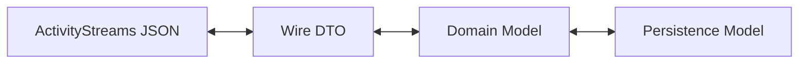

# Domain Model Separation: Wire, Domain, and Persistence

## The Problem

The current `VulnerabilityCase` model subclasses an ActivityStreams object,
collapsing three distinct concerns into one:

- **Wire representation** — ActivityStreams JSON exchanged between Participants
- **Internal domain model** — objects used for behavior logic and persistence
- **Persistence model** — optimized storage structures for the DataLayer

This coupling creates several concrete issues:

- `case_status` and `participant_status` are conceptually **append-only event
  histories**, but are modeled as singular or ambiguously-typed fields.
- `notes` is intended to be append-only but lacks explicit append semantics.
- ActivityStreams `Collection` objects and `Link` references do not map cleanly
  to runtime lists or embedded objects.
- The persistence layer (document-oriented NoSQL) would naturally store lists
  of IDs or embedded sub-documents rather than ActivityStreams-shaped objects.

## Architectural Direction

The correct long-term design introduces a **translation boundary** between
three layers:

### 1. Wire Model (Transport Layer)

- ActivityStreams-compliant JSON objects
- `Collection` / `Link` usage per the AS2 vocabulary
- Federated message payload semantics
- Serialized and deserialized at the inbox/outbox boundary

### 2. Domain Model (Core Logic Layer)

- Behavior-tree-facing objects
- Append-only event log structures (case status history,
  participant status history, notes)
- Enforced invariants and business constraints
- Independent of transport format

### 3. Persistence Model (Storage Layer)

- Optimized for document / object storage (TinyDB, future NoSQL)
- No assumption of relational joins
- Efficient append and replay operations
- Lists of IDs or embedded sub-documents as appropriate

## Design Implications

### Treat Status and Notes as Event Logs

Fields such as `case_status`, `participant_status`, and `notes` SHOULD be
modeled internally as **append-only sequences of typed events**, each with
its own identity and timestamp. The current implementation stores these as
lists; the rename from `case_status` → `case_statuses` (tracked in
`specs/case-management.md` CM-03-006) is the first step toward making
append-only semantics explicit.

ActivityStreams `Collection` then becomes a projection of this log for
transport only.

### Avoid Letting ActivityStreams Drive Core Data Shapes

ActivityStreams is a **serialization vocabulary**, not a domain model. If
wire-format concerns continue to dictate object shape:

- Internal refactors become expensive.
- Behavior-tree logic inherits wire-format artifacts.
- Persistence optimizations are constrained by federation concerns.

Instead, define domain objects around Vultron semantics (Case, Report,
ParticipantState, EmbargoState) and provide explicit adapters to and from
ActivityStreams.

### Plan for Independent Evolution

Introducing a translation boundary allows:

- Freedom to revise internal representations without breaking wire compatibility
- Ability to version wire formats separately from runtime structures
- Cleaner enforcement of invariants at the domain layer

## Current Status

As of early 2026, the prototype **has not yet introduced a full translation
boundary**. `VulnerabilityCase` and related objects still directly subclass
`VultronObject` (which inherits from ActivityStreams `as_Object`). This is
an acceptable prototype shortcut, but the coupling is now beginning to
constrain refactoring, specifically:

- The `case_status` field rename (CM-03-006) requires coordinated changes
  across handlers, tests, and DataLayer helpers.
- The `VulnerabilityCase.case_activity` list cannot store typed activities
  due to ActivityStreams type validation constraints (see `AGENTS.md` for the
  pitfall and workaround).
- The `active_embargo` union type creates silent serialization failures due
  to Pydantic v2 union resolution order (see `AGENTS.md`).

## Recommended Next Steps (When Prioritized)

1. Define canonical **domain model** classes that do not inherit from
   ActivityStreams base types.
2. Introduce explicit `from_activitystreams(...)` / `to_activitystreams(...)`
   adapters.
3. Refactor `VulnerabilityCase` into a domain object plus a separate
   ActivityStreams DTO.
4. Convert `case_status`, `participant_status`, and `notes` into explicit
   append-only typed lists.
5. Treat ActivityStreams `Collection` as a transport-only concern.

**Priority**: This is an architectural improvement, not a feature. It SHOULD
be prioritized before the internal data model grows significantly more complex.
Consider creating an ADR to record the decision formally before implementation.

## Cross-References

- `specs/case-management.md` CM-03-006 — `case_statuses` rename requirement
- `notes/case-state-model.md` — CaseStatus/ParticipantStatus append-only
  history model
- `notes/activitystreams-semantics.md` — `case_activity` type limitation,
  Accept/Reject `object` field patterns
- `AGENTS.md` — pitfalls for `case_activity`, `active_embargo`,
  and `case_status` (singular) field
- `docs/adr/_adr-template.md` — template for future ADR on this separation
