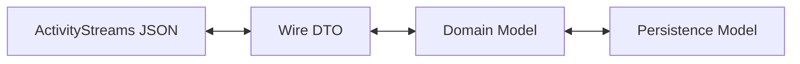

# Domain Model Separation: Wire, Domain, and Persistence

## The Problem

The current `VulnerabilityCase` model subclasses an ActivityStreams object,
collapsing three distinct concerns into one:

- **Wire representation** — ActivityStreams JSON exchanged between Participants
- **Internal domain model** — objects used for behavior logic and persistence
- **Persistence model** — optimized storage structures for the DataLayer

This coupling creates several concrete issues:

- `case_status` and `participant_status` are conceptually **append-only event
  histories**, but are modeled as singular or ambiguously-typed fields.
- `notes` is intended to be append-only but lacks explicit append semantics.
- ActivityStreams `Collection` objects and `Link` references do not map cleanly
  to runtime lists or embedded objects.
- The persistence layer (document-oriented NoSQL) would naturally store lists
  of IDs or embedded sub-documents rather than ActivityStreams-shaped objects.

## Architectural Direction

The correct long-term design introduces a **translation boundary** between
three layers:


```mermaid
flowchart LR
    ASJ[ActivityStreams JSON] <--> WDTO[Wire DTO] <--> DM[Domain Model] <--> PM[Persistence Model]
```

### 1. Wire Model (Transport Layer)

- ActivityStreams-compliant JSON objects
- `Collection` / `Link` usage per the AS2 vocabulary
- Federated message payload semantics
- Serialized and deserialized at the inbox/outbox boundary

### 2. Domain Model (Core Logic Layer)

- Behavior-tree-facing objects
- Append-only event log structures (case status history,
  participant status history, notes)
- Enforced invariants and business constraints
- Independent of transport format

### 3. Persistence Model (Storage Layer)

- Optimized for document / object storage (TinyDB, future NoSQL)
- No assumption of relational joins
- Efficient append and replay operations
- Lists of IDs or embedded sub-documents as appropriate

## Design Implications

### Treat Status and Notes as Event Logs

Fields such as `case_status`, `participant_status`, and `notes` SHOULD be
modeled internally as **append-only sequences of typed events**, each with
its own identity and timestamp. The current implementation stores these as
lists; the rename from `case_status` → `case_statuses` (tracked in
`specs/case-management.md` CM-03-006) is the first step toward making
append-only semantics explicit.

ActivityStreams `Collection` then becomes a projection of this log for
transport only.

### Avoid Letting ActivityStreams Drive Core Data Shapes

ActivityStreams is a **serialization vocabulary**, not a domain model. If
wire-format concerns continue to dictate object shape:

- Internal refactors become expensive.
- Behavior-tree logic inherits wire-format artifacts.
- Persistence optimizations are constrained by federation concerns.

Instead, define domain objects around Vultron semantics (Case, Report,
ParticipantState, EmbargoState) and provide explicit adapters to and from
ActivityStreams.

### Plan for Independent Evolution

Introducing a translation boundary allows:

- Freedom to revise internal representations without breaking wire compatibility
- Ability to version wire formats separately from runtime structures
- Cleaner enforcement of invariants at the domain layer

## Domain Events as the Bridge Between Core and Wire

When removing AS2 wire types from `core/behaviors/` (P65-6), the recommended
pattern is **per-semantic domain event types** rather than a single generic
`VultronEvent` class that mirrors the AS2 structure.

The key insight: domain events only need to be defined for the things that
are represented by use cases — items corresponding to `MessageSemantics`
values or triggerable behaviors. Define specific named event classes such as
`ReportSubmittedEvent`, `CaseCreatedEvent`, `EmbargoAcceptedEvent` rather
than one large generic type. Each event class carries exactly the fields
needed for its specific use case.

This approach:

- Makes the translation point (wire → domain, domain → wire) explicit per
  semantic type, rather than generic
- Supports the use-case-as-port pattern: adapters translate from AS2 activity
  to a specific domain event, and from a domain event back to AS2 for outbound
- Avoids duplicating the full AS2 structure in the core while still retaining
  rich semantic information
- Aligns the domain model with the `MessageSemantics` vocabulary, making the
  relationship between wire format and domain intent explicit

These domain event types belong in `core/models/` alongside `MessageSemantics`.
The outbound serializer in `wire/as2/serializer.py` will map each domain event
type to the appropriate AS2 activity type.

### Naming Convention

Wire-level and domain-level types MUST use distinct suffixes to prevent
accidental coupling (see `specs/code-style.md` CS-10-002):

- Wire layer (`vultron/wire/as2/vocab/activities/`): `FooActivity` — the
  structured AS2 payload the extractor recognizes (e.g., `ReportSubmitActivity`)
- Domain layer (`vultron/core/models/events/`): `FooEvent` — the typed
  domain event handlers and use cases consume (e.g., `ReportSubmittedEvent`)
  - Received-message flavour: `FooReceivedEvent` (remote actor did something)
  - Trigger flavour: `FooTriggerEvent` (local actor initiated an action)

The `events/` directory structure under `core/models/` SHOULD mirror the
`activities/` directory structure under `wire/as2/vocab/`, with submodules
grouped by semantic category (`report.py`, `case.py`, `embargo.py`, etc.).

### Discriminated Event Hierarchy (P65-3 Design)

To support type-safe handler dispatch, the domain event base class (`VultronEvent`
or equivalent) SHOULD carry a discriminator field based on `MessageSemantics`:

```python
# core/models/events/base.py
from vultron.core.models.events import MessageSemantics
from pydantic import BaseModel

class VultronEvent(BaseModel):
    semantic_type: MessageSemantics  # discriminator field
    activity_id: str
    actor_id: str
    object_type: str | None = None
    object_id: str | None = None
    target_type: str | None = None
    target_id: str | None = None
    inner_object_type: str | None = None
    inner_object_id: str | None = None
```

Specific event subclasses extend this base with fields relevant to their
use case. Pydantic's discriminated union functionality then allows the correct
subclass to be reconstructed from the generic base automatically.

**Design principle**: Do not add fields speculatively. Derive the required fields
from a full audit of handler code (P65-3 task) to see exactly which AS2 fields
each handler accesses on `raw_activity`. Add only what the handlers actually need.

The current `InboundPayload` model is the immediate precursor to this design.
The migration path is:

1. Audit all `raw_activity` accesses across handler files (P65-3 audit step).
2. Enrich `InboundPayload` with the fields needed (replacing `raw_activity: Any`).
3. Define per-semantic subclasses and migrate handlers to use them (P65-3a).
4. Update the extractor to produce specific subclasses instead of a generic
   payload (P65-3b).

### P65-6a: `extract_intent()` Should Return a Discriminated Union

Once per-semantic subclasses are defined (step 4 above), `extract_intent()` in
`wire/as2/extractor.py` SHOULD return a discriminated union of `VultronEvent`
subclasses rather than the flat `InboundPayload`. This allows the adapter layer
to pass a strongly-typed domain event directly to the dispatcher; the
`@verify_semantics` decorator continues to operate based on
`dispatchable.payload.semantic_type` without change.

**Implementation notes (P65-6a)**:

- `VultronEvent` base class lives in `core/models/events/base.py` with
  `semantic_type: MessageSemantics` as the discriminator field.
- Per-semantic subclasses live in `core/models/events/` grouped by category
  (`report.py`, `case.py`, `embargo.py`, etc.) following the `FooReceivedEvent`
  suffix convention for inbound handler-side events (see CS-10-002).
- Do **not** add fields speculatively — include only what handler code actually
  needs after the P65-3 audit.
- The wire layer adapter populates the correct subclass from the raw AS2
  activity; core handlers never see AS2 types.

### Outbound Event Design Questions (P65-6 Considerations)

Before implementing the outbound path (domain event → AS2 activity), consider:

- **Which events go in `core/models/`?** Domain events corresponding to
  outbound activities (e.g., `CaseCreatedEvent`, `EmbargoProposedEvent`).
  These are distinct from inbound received events.
- **Outbound serializer mapping**: Should `wire/as2/serializer.py` map each
  domain event type to AS2 one-to-one, or via a generic mapping table?
  One-to-one is safer for type checking; a table is more compact.
- **Interplay with the outbox pipeline**: Domain events emitted by handlers
  must eventually become AS2 activities written to the actor outbox. The
  serializer is the seam between these two concerns (see `specs/outbox.md`).
- **ADR**: Consider drafting an ADR for the domain/wire separation decision
  before implementation, to record the rationale. See `docs/adr/_adr-template.md`.

## Cross-References

- `specs/case-management.md` CM-03-006 — `case_statuses` rename requirement
- `specs/code-style.md` CS-10-001 — typed Pydantic objects at port/adapter boundaries
- `specs/code-style.md` CS-10-002 — `FooActivity` vs `FooEvent` naming convention
- `specs/datalayer.md` — DataLayer port requirements (auto-rehydration, type-safe writes)
- `notes/datalayer-design.md` — DataLayer design notes (auto-rehydration decision,
  storage record evaluation, vocabulary registry entanglement)
- `notes/case-state-model.md` — CaseStatus/ParticipantStatus append-only
  history model
- `notes/activitystreams-semantics.md` — `case_activity` type limitation,
  Accept/Reject `object_` field patterns
- `notes/use-case-behavior-trees.md` — use case/BT layering and mapping from
  protocol activities to use cases
- `AGENTS.md` — pitfalls for `case_activity`, `active_embargo`,
  and `case_status` (singular) field
- `docs/adr/_adr-template.md` — template for future ADR on this separation

---

## DRY Core Domain Models

`vultron/core/models/vultron_types.py` and `vultron/core/models/events.py`
have overlapping responsibilities. Both define domain model classes that
inherit directly from `pydantic.BaseModel`. There is no shared base class
capturing common fields (identity, timestamps, labels).

**Target design**: Define a `VultronObject` base class in core that captures
all fields common across domain objects (e.g., `id`, `name`, `created_at`,
`updated_at`). `VultronEvent` should inherit from `VultronObject`. Other
domain model classes (Case, Report, Participant) should also inherit from
`VultronObject` rather than directly from `BaseModel`.

This mirrors the wire-layer class hierarchy (`as_Base` → `as_Object` →
`as_Activity` → ...) but at the domain level, free of ActivityStreams
vocabulary constraints.

Benefits:

- Eliminates repetitive `id: str`, `name: str` etc. fields scattered across
  models.
- Provides a single place to add cross-cutting concerns (validation, repr).
- Makes the domain hierarchy explicitly parallel to the wire hierarchy.

**See**: `notes/codebase-structure.md` "Core Object Modules" for the
related file-splitting recommendation.

---

## Post-P75-2 Architecture Findings

After P75-2 (handler extraction to `core/use_cases/`), several
implementation details became clear:

### Handler Layer Is Vestigial

`vultron/api/v2/backend/handlers/` now contains thin 2–3-line delegate
functions. Their sole remaining purpose is to call use-case functions and
apply the `@verify_semantics` decorator. This layer can be eliminated by
mapping `SEMANTICS_HANDLERS` directly to use-case callables and moving
semantic verification into the dispatcher.

### SEMANTICS_HANDLERS Belongs in Core

`SEMANTICS_HANDLERS` maps `MessageSemantics` values (domain concepts) to
use-case callables (domain code). This mapping is domain knowledge, not
adapter configuration, and belongs in `core/use_cases/use_case_map.py`.

### ActivityDispatcher as Driving Port

The `ActivityDispatcher` Protocol in `vultron/types.py` should be moved
to `core/ports/dispatcher.py` alongside `DataLayer`. This makes the inbound
dispatch interface explicit and injectable (for testing). The concrete
implementation moves to core (or a thin driving adapter).

### Pattern Naming Inconsistency

`ActivityPattern` instances in `SEMANTICS_ACTIVITY_PATTERNS` in
`extractor.py` use names like `CreateReport`, `EngageCase` — identical to
Activity and Event class names. Adding a `Pattern` suffix (e.g.,
`CreateReportPattern`, `EngageCasePattern`) prevents naming collisions and
clarifies purpose.

**See**: `notes/use-case-behavior-trees.md` for the standardized `UseCase`
protocol proposal.

---

## Wire-Layer Terminology Leaking into Core Event Interfaces

Several core use cases and trigger handlers receive event objects whose field
names (`object`, `target`, `context`, `actor`) are mapped directly from the
AS2 specification rather than using domain-meaningful names. For example, when
an Offer of a report is received, the use case should receive a field named
`report_id` rather than `object_id`. When a note is added to a case, the use
case should receive a `case_id` field rather than a generic `target_id`.

This leakage undermines the hexagonal architecture principle that the core
domain should be expressed in domain vocabulary. It also increases the
cognitive overhead for developers who must mentally translate between AS2
semantics and domain intent when reading core business logic.

**Recommended approach:** For each received-event subtype, ensure that all
fields use domain-appropriate names. Where the AS2 mapping is non-obvious,
add a comment or alias. New event subtypes introduced for Priority 90 and
beyond should follow domain naming from the start.

**Reference:** `specs/architecture.md` ARCH-09 (core MUST NOT leak wire
concerns); `specs/code-style.md` CS-12-001 (domain vocabulary in class names).

---

## Extractor as EventFactory: Centralizing AS2→Domain Mapping

TECHDEBT-30 added domain-specific property getters to event subclasses via
`_mixins.py`. The next evolution is to have the extractor produce
domain-specific event objects directly, rather than a generic event that
then exposes typed properties through mixin aliases.

**Current state**: `extractor.py` maps `(AS2 Activity type, Object type)` to
`MessageSemantics`, and a generic `VultronEvent` carries the raw AS2 fields.
Mixins added in TECHDEBT-30 give use-case code a cleaner property API, but
the event object itself still carries AS2-named fields (`object_id`,
`target_id`, etc.) internally.

**Design option — EventFactory pattern**: Rather than having the extractor
only classify the activity, it could also perform the field translation and
return a type-specific domain event. Two equivalent approaches:

- `Activity.to_domain()` — an instance method on AS2 activity models that
  returns the appropriate domain event subclass.
- `EventFactory` — a standalone translator that takes an AS2 activity,
  determines the semantics (as the extractor does now), and constructs a
  domain event object with fully domain-named fields.

The domain event then becomes the direct input to its corresponding use case,
making the use case's field access completely free of AS2 naming.

**Key principles for implementation**:

- Use `extractor.py`'s `ActivityPattern` definitions as the authoritative
  reference for how AS2 fields map to semantic roles. Centralise this mapping
  in one place rather than scattering AS2 field name handling across use cases.
- Core objects MUST be ignorant of AS2: they must not import from
  `vultron/wire/as2/` or reference `as_*` field names.
- Apply DRY: a single mapping dict or factory function per semantics type
  is preferable to per-use-case translation code.

**Implementation note**: `VultronEvent` may be too generic as a single base
class if use cases are expected to reliably infer field semantics from it.
Per-semantic subclasses (already partially in place from P65-3) combined with
the EventFactory approach give both type safety and domain clarity. See the
"Discriminated Event Hierarchy" section above for the design blueprint.

**See also**: `specs/semantic-extraction.md`, `specs/code-style.md` CS-10-002
(`FooActivity` vs `FooEvent` naming), `notes/domain-model-separation.md`
"Domain Events as the Bridge Between Core and Wire".

---

## Actor Isolation and Outbox Delivery Design Decisions

### Actor Isolation Invariant

Each actor MUST be isolated in its own process and environment (e.g., a
container). All interaction between actors happens exclusively through
sending and receiving Vultron AS2 messages via the HTTP API. No actor can
directly access another actor's DataLayer.

**Consequences:**

- Outbox delivery cannot assume local access to other actors' data or state.
- Outbox delivery MUST use HTTP POST to remote inboxes via the FastAPI
  adapter (`DeliveryQueueAdapter.emit()` POSTs to `{actor_uri}/inbox/`).
- Idempotency cannot be checked by inspecting a remote DataLayer. The inbox
  handler itself MUST handle duplicates — checking `actor.inbox.items` and
  returning HTTP 202 immediately on a duplicate activity ID.

### Outbox Delivery is HTTP POST

`DeliveryQueueAdapter.emit()` delivers outbound activities via async
`httpx.AsyncClient` HTTP POST to `{actor_uri}/inbox/`. Direct DataLayer
writes to recipient inboxes are **not** used.

OX-1.3 idempotency is enforced at `POST /actors/{id}/inbox/`: the endpoint
checks `actor.inbox.items` (the persistent received log) before enqueueing
and returns 202 immediately on a duplicate activity ID.

Trigger use-cases and BT nodes that create outgoing activities call
`dl.record_outbox_item(actor_id, activity_id)` to enqueue items in
`{actor_id}_outbox`, which `outbox_handler` drains.

**Reference:** `plan/IMPLEMENTATION_NOTES.md` entries dated 2026-03-25.
