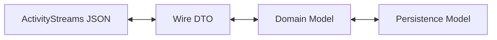

# Domain Model Separation: Wire, Domain, and Persistence

## The Problem

The current `VulnerabilityCase` model subclasses an ActivityStreams object,
collapsing three distinct concerns into one:

- **Wire representation** — ActivityStreams JSON exchanged between Participants
- **Internal domain model** — objects used for behavior logic and persistence
- **Persistence model** — optimized storage structures for the DataLayer

This coupling creates several concrete issues:

- `case_status` and `participant_status` are conceptually **append-only event
  histories**, but are modeled as singular or ambiguously-typed fields.
- `notes` is intended to be append-only but lacks explicit append semantics.
- ActivityStreams `Collection` objects and `Link` references do not map cleanly
  to runtime lists or embedded objects.
- The persistence layer (document-oriented NoSQL) would naturally store lists
  of IDs or embedded sub-documents rather than ActivityStreams-shaped objects.

## Architectural Direction

The correct long-term design introduces a **translation boundary** between
three layers:


```mermaid
flowchart LR
    ASJ[ActivityStreams JSON] <--> WDTO[Wire DTO] <--> DM[Domain Model] <--> PM[Persistence Model]
```

### 1. Wire Model (Transport Layer)

- ActivityStreams-compliant JSON objects
- `Collection` / `Link` usage per the AS2 vocabulary
- Federated message payload semantics
- Serialized and deserialized at the inbox/outbox boundary

### 2. Domain Model (Core Logic Layer)

- Behavior-tree-facing objects
- Append-only event log structures (case status history,
  participant status history, notes)
- Enforced invariants and business constraints
- Independent of transport format

### 3. Persistence Model (Storage Layer)

- Optimized for document / object storage (TinyDB, future NoSQL)
- No assumption of relational joins
- Efficient append and replay operations
- Lists of IDs or embedded sub-documents as appropriate

## Design Implications

### Treat Status and Notes as Event Logs

Fields such as `case_status`, `participant_status`, and `notes` SHOULD be
modeled internally as **append-only sequences of typed events**, each with
its own identity and timestamp. The current implementation stores these as
lists; the rename from `case_status` → `case_statuses` (tracked in
`specs/case-management.md` CM-03-006) is the first step toward making
append-only semantics explicit.

ActivityStreams `Collection` then becomes a projection of this log for
transport only.

### Avoid Letting ActivityStreams Drive Core Data Shapes

ActivityStreams is a **serialization vocabulary**, not a domain model. If
wire-format concerns continue to dictate object shape:

- Internal refactors become expensive.
- Behavior-tree logic inherits wire-format artifacts.
- Persistence optimizations are constrained by federation concerns.

Instead, define domain objects around Vultron semantics (Case, Report,
ParticipantState, EmbargoState) and provide explicit adapters to and from
ActivityStreams.

### Plan for Independent Evolution

Introducing a translation boundary allows:

- Freedom to revise internal representations without breaking wire compatibility
- Ability to version wire formats separately from runtime structures
- Cleaner enforcement of invariants at the domain layer

## Current Status

As of early 2026, the prototype **has not yet introduced a full translation
boundary**. `VulnerabilityCase` and related objects still directly subclass
`VultronObject` (which inherits from ActivityStreams `as_Object`). This is
an acceptable prototype shortcut, but the coupling is now beginning to
constrain refactoring, specifically:

- The `case_status` field rename (CM-03-006) requires coordinated changes
  across handlers, tests, and DataLayer helpers.
- The `VulnerabilityCase.case_activity` list cannot store typed activities
  due to ActivityStreams type validation constraints (see `AGENTS.md` for the
  pitfall and workaround).
- The `active_embargo` union type creates silent serialization failures due
  to Pydantic v2 union resolution order (see `AGENTS.md`).

## Recommended Next Steps (When Prioritized)

1. Define canonical **domain model** classes that do not inherit from
   ActivityStreams base types.
2. Introduce explicit `from_activitystreams(...)` / `to_activitystreams(...)`
   adapters.
3. Refactor `VulnerabilityCase` into a domain object plus a separate
   ActivityStreams DTO.
4. Convert `case_status`, `participant_status`, and `notes` into explicit
   append-only typed lists.
5. Treat ActivityStreams `Collection` as a transport-only concern.

**Priority**: This is an architectural improvement, not a feature. It SHOULD
be prioritized before the internal data model grows significantly more complex.
Consider creating an ADR to record the decision formally before implementation.

## Domain Events as the Bridge Between Core and Wire

When removing AS2 wire types from `core/behaviors/` (P65-6), the recommended
pattern is **per-semantic domain event types** rather than a single generic
`VultronEvent` class that mirrors the AS2 structure.

The key insight: domain events only need to be defined for the things that
are represented by use cases — items corresponding to `MessageSemantics`
values or triggerable behaviors. Define specific named event classes such as
`ReportSubmittedEvent`, `CaseCreatedEvent`, `EmbargoAcceptedEvent` rather
than one large generic type. Each event class carries exactly the fields
needed for its specific use case.

This approach:

- Makes the translation point (wire → domain, domain → wire) explicit per
  semantic type, rather than generic
- Supports the use-case-as-port pattern: adapters translate from AS2 activity
  to a specific domain event, and from a domain event back to AS2 for outbound
- Avoids duplicating the full AS2 structure in the core while still retaining
  rich semantic information
- Aligns the domain model with the `MessageSemantics` vocabulary, making the
  relationship between wire format and domain intent explicit

These domain event types belong in `core/models/` alongside `MessageSemantics`.
The outbound serializer in `wire/as2/serializer.py` will map each domain event
type to the appropriate AS2 activity type.

### Naming Convention

Wire-level and domain-level types MUST use distinct suffixes to prevent
accidental coupling (see `specs/code-style.md` CS-10-002):

- Wire layer (`vultron/wire/as2/vocab/activities/`): `FooActivity` — the
  structured AS2 payload the extractor recognizes (e.g., `ReportSubmitActivity`)
- Domain layer (`vultron/core/models/events/`): `FooEvent` — the typed
  domain event handlers and use cases consume (e.g., `ReportSubmittedEvent`)
  - Received-message flavour: `FooReceivedEvent` (remote actor did something)
  - Trigger flavour: `FooTriggerEvent` (local actor initiated an action)

The `events/` directory structure under `core/models/` SHOULD mirror the
`activities/` directory structure under `wire/as2/vocab/`, with submodules
grouped by semantic category (`report.py`, `case.py`, `embargo.py`, etc.).

### Discriminated Event Hierarchy (P65-3 Design)

To support type-safe handler dispatch, the domain event base class (`VultronEvent`
or equivalent) SHOULD carry a discriminator field based on `MessageSemantics`:

```python
# core/models/events/base.py
from vultron.core.models.events import MessageSemantics
from pydantic import BaseModel

class VultronEvent(BaseModel):
    semantic_type: MessageSemantics  # discriminator field
    activity_id: str
    actor_id: str
    object_type: str | None = None
    object_id: str | None = None
    target_type: str | None = None
    target_id: str | None = None
    inner_object_type: str | None = None
    inner_object_id: str | None = None
```

Specific event subclasses extend this base with fields relevant to their
use case. Pydantic's discriminated union functionality then allows the correct
subclass to be reconstructed from the generic base automatically.

**Design principle**: Do not add fields speculatively. Derive the required fields
from a full audit of handler code (P65-3 task) to see exactly which AS2 fields
each handler accesses on `raw_activity`. Add only what the handlers actually need.

The current `InboundPayload` model is the immediate precursor to this design.
The migration path is:

1. Audit all `raw_activity` accesses across handler files (P65-3 audit step).
2. Enrich `InboundPayload` with the fields needed (replacing `raw_activity: Any`).
3. Define per-semantic subclasses and migrate handlers to use them (P65-3a).
4. Update the extractor to produce specific subclasses instead of a generic
   payload (P65-3b).

### P65-6a: `extract_intent()` Should Return a Discriminated Union

Once per-semantic subclasses are defined (step 4 above), `extract_intent()` in
`wire/as2/extractor.py` SHOULD return a discriminated union of `VultronEvent`
subclasses rather than the flat `InboundPayload`. This allows the adapter layer
to pass a strongly-typed domain event directly to the dispatcher; the
`@verify_semantics` decorator continues to operate based on
`dispatchable.payload.semantic_type` without change.

**Implementation notes (P65-6a)**:

- `VultronEvent` base class lives in `core/models/events/base.py` with
  `semantic_type: MessageSemantics` as the discriminator field.
- Per-semantic subclasses live in `core/models/events/` grouped by category
  (`report.py`, `case.py`, `embargo.py`, etc.) following the `FooReceivedEvent`
  suffix convention for inbound handler-side events (see CS-10-002).
- Do **not** add fields speculatively — include only what handler code actually
  needs after the P65-3 audit.
- The wire layer adapter populates the correct subclass from the raw AS2
  activity; core handlers never see AS2 types.

### Outbound Event Design Questions (P65-6 Considerations)

Before implementing the outbound path (domain event → AS2 activity), consider:

- **Which events go in `core/models/`?** Domain events corresponding to
  outbound activities (e.g., `CaseCreatedEvent`, `EmbargoProposedEvent`).
  These are distinct from inbound received events.
- **Outbound serializer mapping**: Should `wire/as2/serializer.py` map each
  domain event type to AS2 one-to-one, or via a generic mapping table?
  One-to-one is safer for type checking; a table is more compact.
- **Interplay with the outbox pipeline**: Domain events emitted by handlers
  must eventually become AS2 activities written to the actor outbox. The
  serializer is the seam between these two concerns (see `specs/outbox.md`).
- **ADR**: Consider drafting an ADR for the domain/wire separation decision
  before implementation, to record the rationale. See `docs/adr/_adr-template.md`.

## Cross-References

- `specs/case-management.md` CM-03-006 — `case_statuses` rename requirement
- `specs/code-style.md` CS-10-001 — typed Pydantic objects at port/adapter boundaries
- `specs/code-style.md` CS-10-002 — `FooActivity` vs `FooEvent` naming convention
- `notes/case-state-model.md` — CaseStatus/ParticipantStatus append-only
  history model
- `notes/activitystreams-semantics.md` — `case_activity` type limitation,
  Accept/Reject `object` field patterns
- `notes/use-case-behavior-trees.md` — use case/BT layering and mapping from
  protocol activities to use cases
- `AGENTS.md` — pitfalls for `case_activity`, `active_embargo`,
  and `case_status` (singular) field
- `docs/adr/_adr-template.md` — template for future ADR on this separation

---

## DataLayer as a Port, TinyDB as a Driven Adapter

Independently of per-actor isolation, the `DataLayer` interface is treated as
a **port** in the hexagonal architecture sense, and the `TinyDbDataLayer`
implementation as a **driven adapter** that satisfies the port.

This distinction matters even now, before per-actor isolation is implemented:

- The port (Protocol interface) defines what the domain needs from persistence.
- The adapter (TinyDB) provides a concrete implementation behind that interface.
- A future MongoDB adapter would implement the same Protocol without requiring
  core domain changes.

**Current state (P65-1 complete)**: The `DataLayer` Protocol is defined in
`vultron/core/ports/activity_store.py`. The old location
(`vultron/api/v2/datalayer/abc.py`) is a backward-compat re-export shim. All
core BT nodes import `DataLayer` from `core/ports/`. Handlers receive the
`DataLayer` via dependency injection (achieved in ARCH-1.4).

**Remaining step (P70)**: Relocate the `TinyDbDataLayer` implementation and
`get_datalayer()` factory from `vultron/api/v2/datalayer/` to
`vultron/adapters/driven/activity_store.py` (or equivalent) when P60-3
(adapters package stub) is complete.

**Design Decision**: The DataLayer relocation into the adapter layer SHOULD
be planned together with PRIORITY 100 (actor independence) and the potential
MongoDB switch. See the per-actor isolation options below.

---

## Per-Actor DataLayer Isolation Options

All actors currently share a singleton `TinyDbDataLayer` backed by a single
`plan/mydb.json` file. This violates `specs/case-management.md` CM-01-001
(actor isolation) even though demo scripts manually sequence activities to
simulate isolation.

Before implementing PRIORITY 100 (actor independence), a design decision is
needed. Three options:

**Option A — One file per actor**
Each actor gets its own TinyDB file (e.g., `{actor_id}.json`). Simple to
reason about, but creates many files and complicates the DataLayer reset
endpoint used by demo scripts.

**Option B — Namespace prefix per actor (one file)**
One TinyDB file with a separate table per `actor_id`. Keeps a single file;
partitions data cleanly by actor. **This is the recommended option.**

**Rationale for Option B**: In a production database (e.g., MongoDB), you
would naturally use a separate collection or namespace per actor. Option B
mirrors that pattern at the TinyDB level — making migration to a robust
backing store straightforward. It also supports the multi-tenant scenario
where a vulnerability disclosure provider connects multiple actor containers
to a single backing store; and the vendor scenario where all actor containers
share a vendor-specific backing store. Option B is the path of least
resistance to production readiness.

**Option C — In-memory DataLayer per actor (no persistence)**
A dict-backed DataLayer scoped per actor. Good for tests; insufficient for
production or Docker demos where state must survive restarts.

### Production Path: MongoDB Community Edition

When implementing PRIORITY 100 (actor independence), the recommended
production-grade approach is to **replace TinyDB with MongoDB Community
Edition** running in Docker. This is separate from the namespace prefix
decision for the TinyDB prototype but should be done in tandem with
actor independence work, for two reasons:

1. **Demonstration credibility**: Showing each actor running in its own
   container with its own MongoDB-backed DataLayer instance is a much
   stronger demonstration of true actor independence than a shared TinyDB
   file with namespace prefixes.
2. **Docker Compose readiness**: Standardized MongoDB community images
   and Docker Compose dependency patterns make multi-actor demos
   straightforward to configure. This is significantly easier than
   continuing to extend TinyDB for multi-actor scenarios.

**Recommended approach**: Implement Option B (TinyDB namespace prefix)
as a near-term bridge to make PRIORITY 30 (triggerable behaviors) and
PRIORITY 100 (actor independence) work without requiring a full database
swap. Then replace TinyDB with MongoDB as a concurrent or follow-on step
when building the multi-actor Docker demos in PRIORITY 300.

**Design Decision**: (blocks ACT-1) The MongoDB switch and the
per-actor namespace isolation SHOULD be implemented together in the same
phase as PRIORITY 100. The DataLayer interface (`vultron/api/v2/datalayer/
abc.py`) is already an abstraction layer; the MongoDB backend can be
implemented as a new concrete implementation behind the same interface.

**See**: `plan/IMPLEMENTATION_PLAN.md` Phase PRIORITY-100 (ACT-1/ACT-2/ACT-3),
`notes/demo-future-ideas.md` (multi-actor demo scenarios requiring MongoDB
or equivalent for PRIORITY 300),
`notes/triggerable-behaviors.md` "Relationship to Actor Independence".

**Implementation note**: Whichever backing store is chosen, the `BackgroundTasks`
inbox handler MUST resolve the correct per-actor DataLayer instance from the
`actor_id` route parameter. The `get_datalayer` FastAPI dependency MUST accept
an `actor_id` argument and return an isolated instance. Triggerable behavior
endpoints (PRIORITY 30) share the same dependency injection mechanism.
