# Mermaid Sequence Diagram Reference

A sequence diagram is an interaction diagram that shows how processes
operate with one another and in what order. This file is a reference for
authoring Mermaid sequence diagrams in project documentation.

**Source**: Mermaid v11 documentation
(<https://mermaid.js.org/syntax/sequenceDiagram.html>)

---

## Basic Structure

Every sequence diagram begins with `sequenceDiagram`:

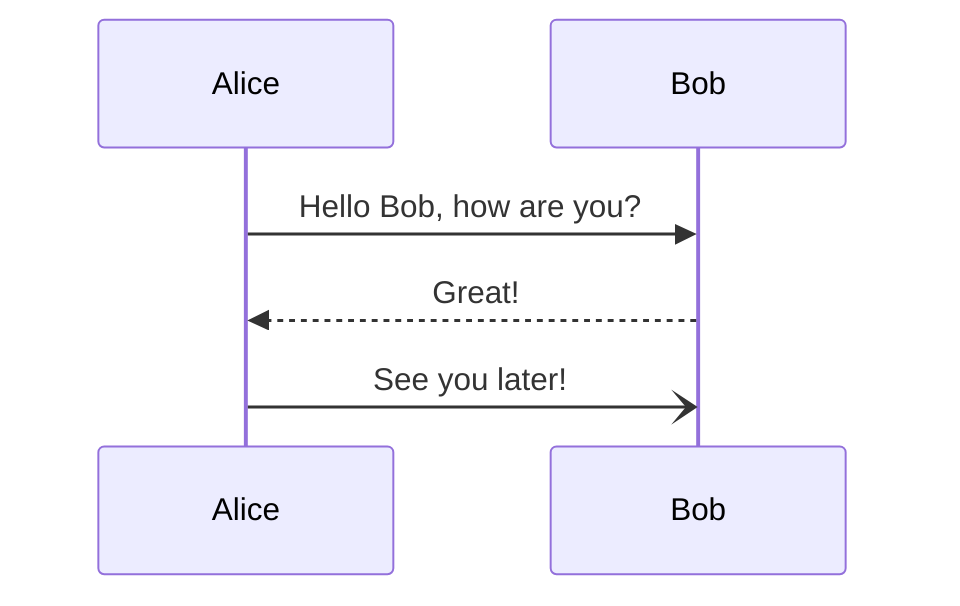

> **Caution**: The word `end` (unquoted) can break a diagram. Wrap it in
> parentheses `(end)`, quotes `"end"`, or brackets `[end]` / `{end}` when
> it appears as part of a label.

---

## Participants

Participants are declared implicitly (in order of first appearance) or
explicitly to control their display order:

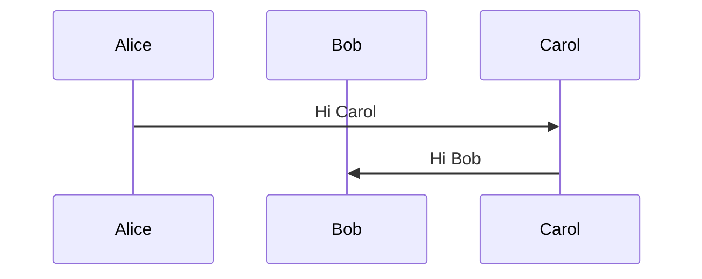

Explicit declarations appear left-to-right in the order listed, regardless
of which participant sends the first message.

### Participant Types (Stereotypes)

Use specific keywords to render participants with UML-style symbols
instead of plain rectangles.

| Keyword       | Rendered symbol   |
|---------------|-------------------|
| `participant` | Rectangle (default) |
| `actor`       | Stick figure      |
| `boundary`    | Boundary circle   |
| `control`     | Control circle    |
| `entity`      | Entity circle     |
| `database`    | Database cylinder |
| `collections` | Collections symbol |
| `queue`       | Queue symbol      |

**Boundary / Control / Entity / Database / Collections / Queue** require
JSON configuration syntax:

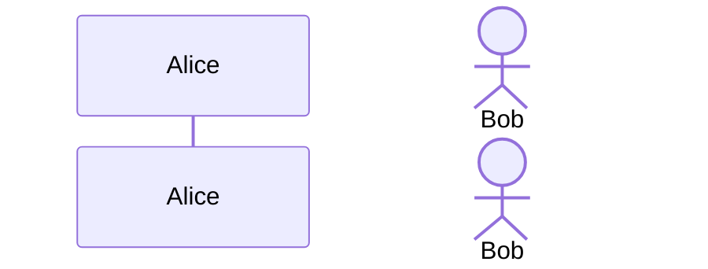

---

## Aliases

An alias gives a participant a short identifier and a descriptive display
label.

### External Alias (`as` keyword)

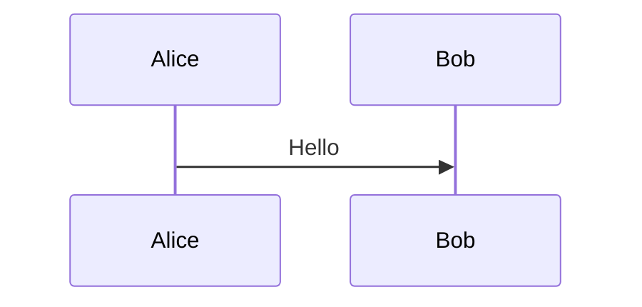

The `as` keyword works with all participant stereotype keywords
(`actor`, `boundary`, etc.).

### Inline Alias (JSON configuration object)

```mermaid
sequenceDiagram
    participant {"id": "A", "alias": "Alice"}
    participant {"id": "B", "alias": "Bob"}
    A->>B: Hello
```

**Precedence**: When both styles are supplied for the same participant,
the **external** (`as`) alias wins.

---

## Actor Creation and Destruction (v10.3.0+)

Actors can be created or destroyed mid-diagram using `create` and
`destroy` directives immediately before the message:

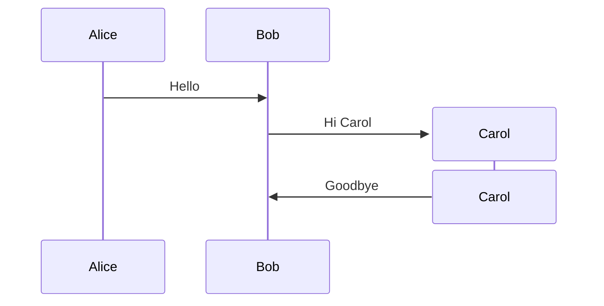

- The **recipient** of a message may be created with `create`.
- Either the sender or recipient may be destroyed with `destroy`.

---

## Grouping / Box

Related actors can be enclosed in a labeled, optionally colored box:

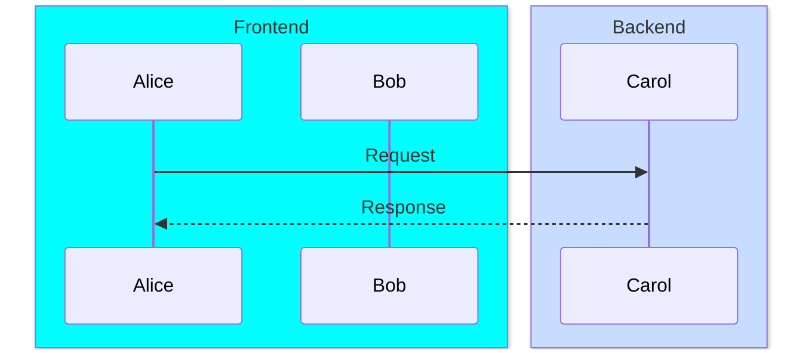

Color can be a named color, `rgb(r,g,b)`, or `rgba(r,g,b,a)`. If the
group name is itself a color name, prefix with `transparent` to avoid
ambiguity:

```mermaid
box transparent Aqua
    participant Alice
end
```

---

## Messages

Message syntax:

```text
[Sender][ArrowType][Receiver]: Message text
```

### Standard Arrow Types

| Syntax     | Appearance                                          |
|------------|-----------------------------------------------------|
| `->`       | Solid line, no arrowhead                            |
| `-->`      | Dotted line, no arrowhead                           |
| `->>`      | Solid line with arrowhead                           |
| `-->>`     | Dotted line with arrowhead                          |
| `<<->>`    | Solid line, bidirectional arrowheads (v11.0.0+)     |
| `<<-->>`   | Dotted line, bidirectional arrowheads (v11.0.0+)    |
| `-x`       | Solid line with a cross at the end                  |
| `--x`      | Dotted line with a cross at the end                 |
| `-)`       | Solid line, open arrow (async)                      |
| `--)`      | Dotted line, open arrow (async)                     |

### Half-Arrow Types (v11.12.3+)

Half-arrows express directed partial signal notation. Solid variants use
a single dash; dotted variants use double dashes.

| Syntax | Description                           |
|--------|---------------------------------------|
| `-&#124;\`  | Solid, top half arrowhead             |
| `--&#124;\` | Dotted, top half arrowhead            |
| `-&#124;/`  | Solid, bottom half arrowhead          |
| `--&#124;/` | Dotted, bottom half arrowhead         |
| `/&#124;-`  | Solid, reverse top half arrowhead     |
| `/&#124;--` | Dotted, reverse top half arrowhead    |
| `\\-`  | Solid, reverse bottom half arrowhead  |
| `\\--` | Dotted, reverse bottom half arrowhead |
| `-\\`  | Solid, top stick half arrowhead       |
| `--\\` | Dotted, top stick half arrowhead      |
| `-//`  | Solid, bottom stick half arrowhead    |
| `--//` | Dotted, bottom stick half arrowhead   |
| `//-`  | Solid, reverse top stick half         |
| `//--` | Dotted, reverse top stick half        |

### Central Connections (v11.12.3+)

Append `()` to the arrow to connect to a central lifeline point rather
than directly between actors:

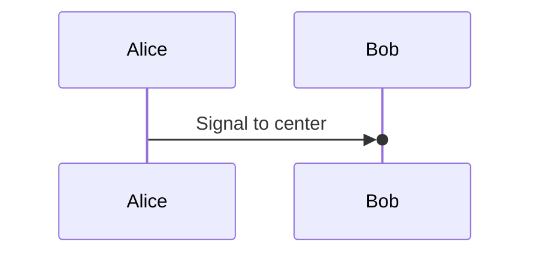

---

## Activations

Activation bars show when an actor is processing. Use explicit keywords:

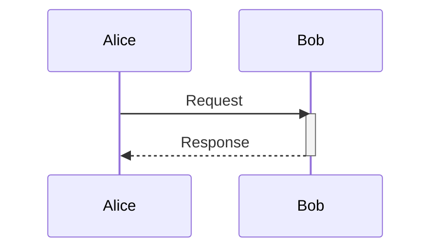

Or use the shorthand `+` / `-` suffixes on the arrow:

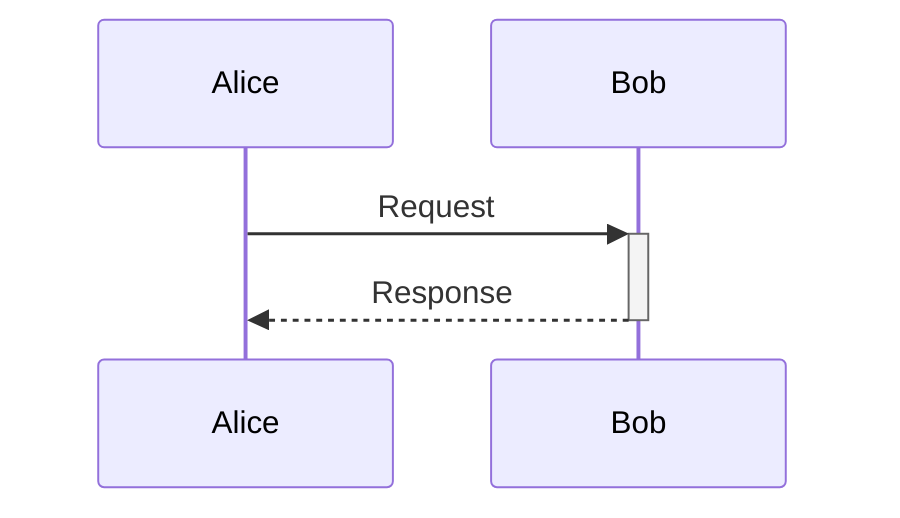

Activations can be **stacked** on the same actor:

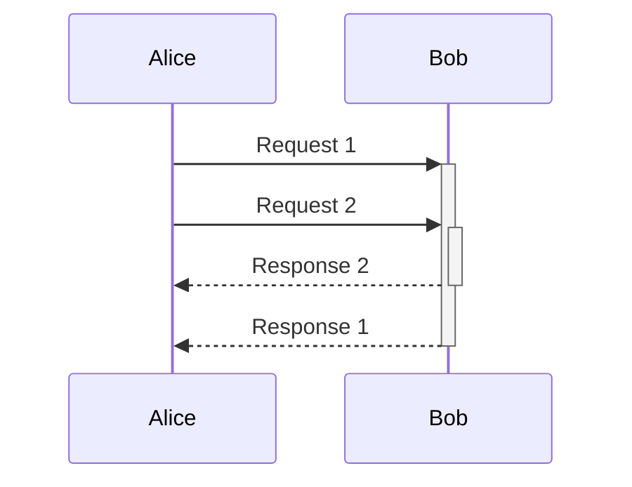

---

## Notes

Notes attach textual annotations to actors.

Syntax:

```text
Note [right of | left of | over] [Actor]: Note text
```

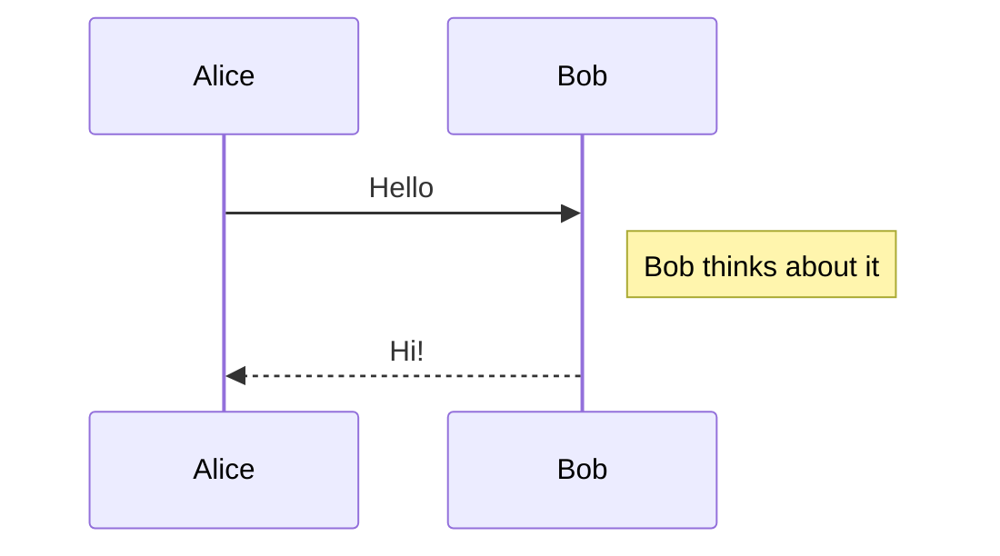

Notes can **span two participants** by listing both separated by a comma:

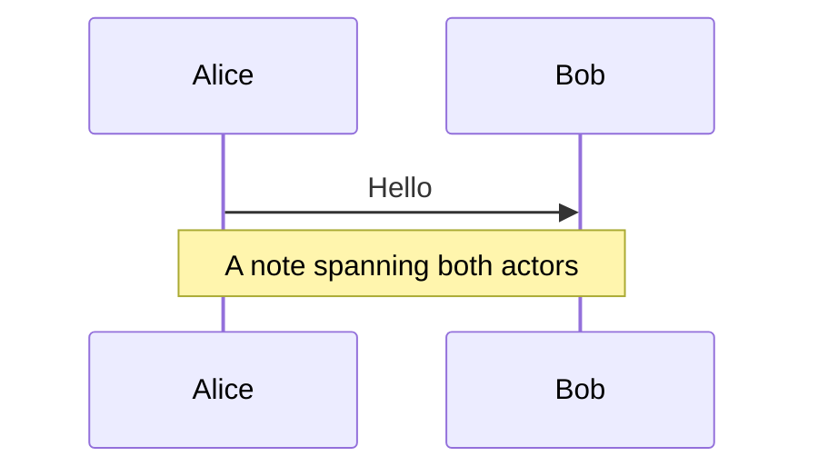

---

## Line Breaks

Use `<br/>` inside message text or note text to force a line break:

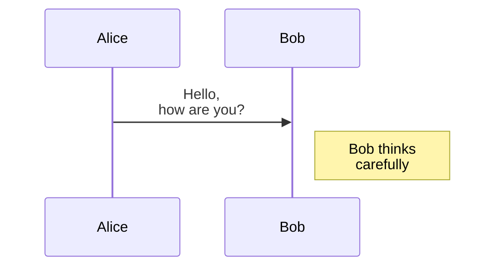

Line breaks in actor **names** require an alias:

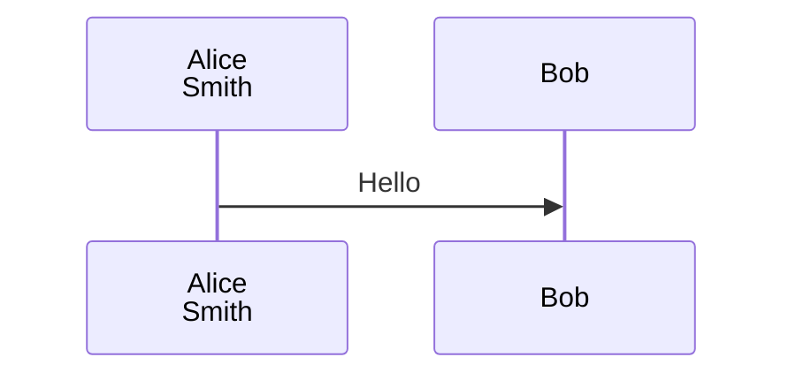

---

## Loops

```text
loop Loop description
    ... statements ...
end
```

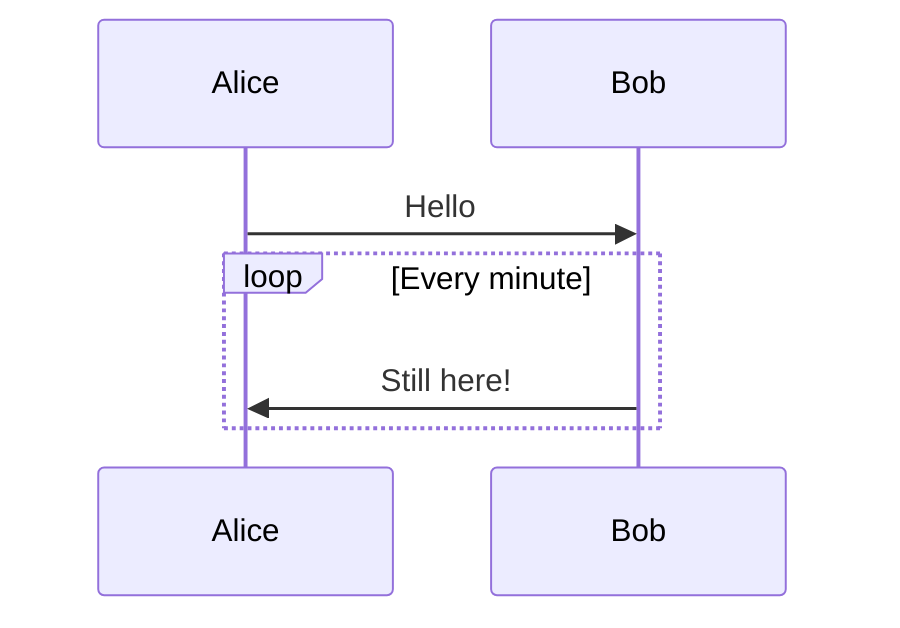

---

## Alt (Conditional / Alternative Paths)

```text
alt Describing text
    ... statements ...
else
    ... statements ...
end
```

For an optional sequence (if without else), use `opt`:

```text
opt Describing text
    ... statements ...
end
```

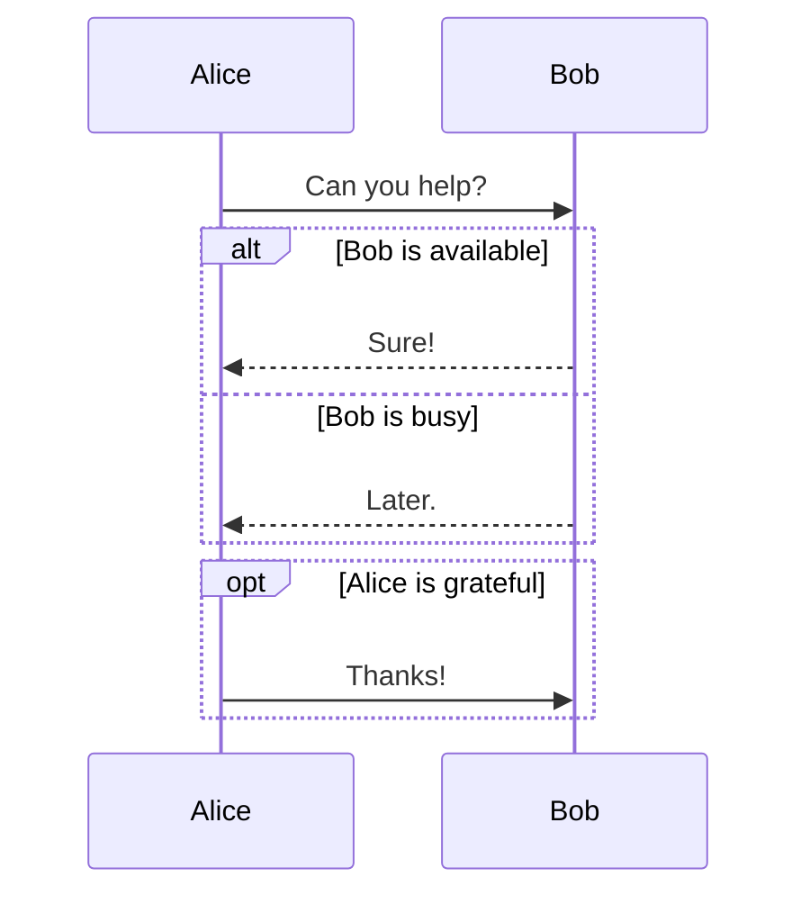

---

## Parallel

Show concurrent actions with `par` / `and`:

```text
par [Action 1]
    ... statements ...
and [Action 2]
    ... statements ...
end
```

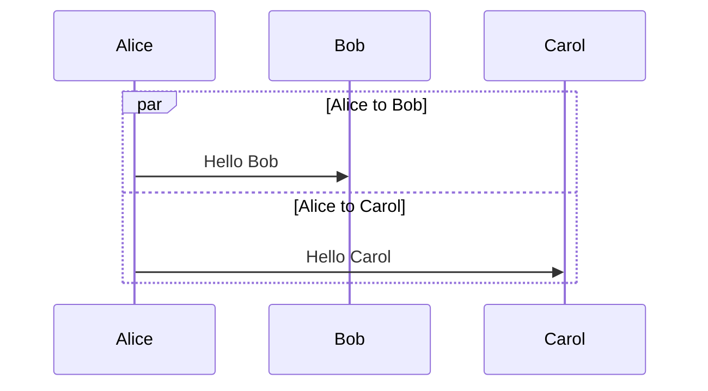

`par` blocks can be nested.

---

## Critical Region

Model actions that must happen automatically with conditional handling:

```text
critical [Action that must be performed]
    ... statements ...
option [Circumstance A]
    ... statements ...
option [Circumstance B]
    ... statements ...
end
```

Options may be omitted entirely. `critical` blocks can be nested.

---

## Break

Indicate an exception or stop in the flow:

```text
break [something happened]
    ... statements ...
end
```

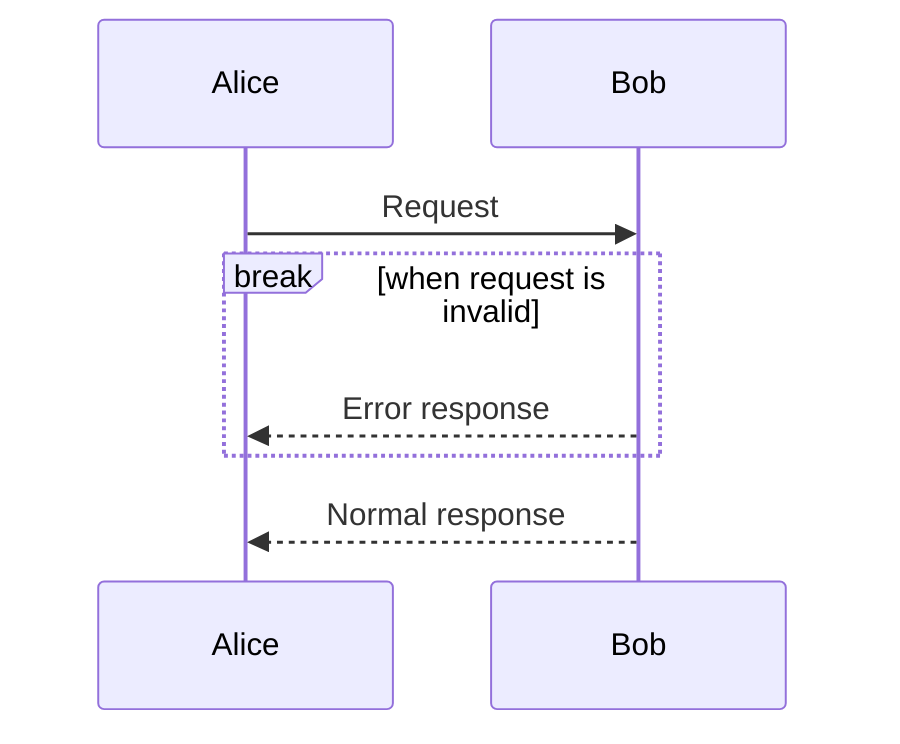

---

## Background Highlighting

Highlight a region with a colored background rect:

```text
rect COLOR
    ... content ...
end
```

Use `rgb()` or `rgba()`:

```mermaid
sequenceDiagram
    rect rgb(200, 255, 200)
        Alice->>Bob: Request
        Bob-->>Alice: Response
    end
    rect rgba(255, 0, 0, .1)
        Alice->>Carol: Another request
    end
```

---

## Comments

Comments are prefixed with `%%` and must be on their own line. All text
from `%%` to the end of the line is ignored by the parser:

```mermaid
sequenceDiagram
    %% This is a comment
    Alice->>Bob: Hello
    %% Bob replies
    Bob-->>Alice: Hi
```

---

## Entity Codes (Escaping Characters)

Use HTML decimal entity codes to include special characters. Numbers are
base 10:

- `#35;` → `#`
- `#59;` → `;` (semicolons must be escaped because they can serve as
  line separators in Mermaid syntax)

HTML character names (e.g., `&amp;`) are also supported.

---

## Sequence Numbers (autonumber)

Add auto-incrementing sequence numbers to all arrows:

**Via diagram code** (preferred for docs):

```mermaid
sequenceDiagram
    autonumber
    Alice->>Bob: Request
    Bob-->>Alice: Response
```

**Via JavaScript initialization**:

```html
<script>
  mermaid.initialize({ sequence: { showSequenceNumbers: true } });
</script>
```

---

## Actor Menus

Actors can expose popup menus linking to external resources. Useful when
an actor represents a service.

**Single link**:

```text
link <actor>: <link-label> @ <link-url>
```

**Multiple links (JSON syntax)**:

```text
links <actor>: {"label1": "url1", "label2": "url2"}
```

```mermaid
sequenceDiagram
    participant Alice
    link Alice: Dashboard @ https://example.com/dashboard
    links Alice: {"Repo": "https://github.com/example", "Wiki": "https://wiki.example.com"}
    Alice->>Bob: Hello
```

---

## Styling

Sequence diagram styling is controlled via CSS classes defined in
`src/themes/sequence.scss`.

### Key CSS Classes

| Class          | Target                                                         |
|----------------|----------------------------------------------------------------|
| `actor`        | Actor box fill and stroke                                      |
| `actor-top`    | Actor figure/box at the top of the diagram                     |
| `actor-bottom` | Actor figure/box at the bottom of the diagram                  |
| `text.actor`   | Text in all actor boxes                                        |
| `actor-line`   | Vertical lifeline of an actor                                  |
| `messageLine0` | Solid message lines                                            |
| `messageLine1` | Dotted message lines                                           |
| `messageText`  | Text on message arrows                                         |
| `labelBox`     | Label box to the left of loop/alt/par regions                  |
| `labelText`    | Text inside label boxes                                        |
| `loopText`     | Text inside loop region boxes                                  |
| `loopLine`     | Lines bounding loop/alt/par regions                            |
| `note`         | Note box fill and stroke                                       |
| `noteText`     | Text inside note boxes                                         |

---

## Configuration Parameters

Pass a `sequenceConfig` object to `mermaid.initialize()` to tune layout:

```javascript
mermaid.sequenceConfig = {
    diagramMarginX: 50,
    diagramMarginY: 10,
    boxTextMargin: 5,
    noteMargin: 10,
    messageMargin: 35,
    mirrorActors: true,
};
```

| Parameter           | Description                                              | Default              |
|---------------------|----------------------------------------------------------|----------------------|
| `mirrorActors`      | Render actor labels both above and below the diagram     | `false`              |
| `bottomMarginAdj`   | Extra margin below the diagram (avoids CSS clipping)     | `1`                  |
| `actorFontSize`     | Font size for actor labels                               | `14`                 |
| `actorFontFamily`   | Font family for actor labels                             | `"Open Sans", sans-serif` |
| `actorFontWeight`   | Font weight for actor labels                             | `"Open Sans", sans-serif` |
| `noteFontSize`      | Font size for notes                                      | `14`                 |
| `noteFontFamily`    | Font family for notes                                    | `"trebuchet ms", verdana, arial` |
| `noteFontWeight`    | Font weight for notes                                    | `"trebuchet ms", verdana, arial` |
| `noteAlign`         | Text alignment inside notes                              | `center`             |
| `messageFontSize`   | Font size for message labels                             | `16`                 |
| `messageFontFamily` | Font family for message labels                           | `"trebuchet ms", verdana, arial` |
| `messageFontWeight` | Font weight for message labels                           | `"trebuchet ms", verdana, arial` |

---

## Quick Reference

```mermaid
sequenceDiagram
    autonumber
    participant A as Alice
    actor B as Bob

    rect rgb(240, 248, 255)
        A->>+B: Request
        Note right of B: Processing...
        B-->>-A: Response
    end

    loop Retry on failure
        A->>B: Retry
        B-->>A: Ack
    end

    alt Success
        A->>B: Commit
    else Failure
        A->>B: Rollback
    end

    opt Optional step
        A->>B: Cleanup
    end

    par Concurrent notifications
        A->>B: Notify B
    and
        A->>B: Notify C
    end

    break On error
        B-->>A: Error
    end
```
