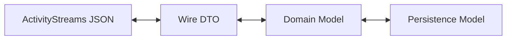

# Implementation Notes

Longer-term notes can be found in `/notes/*.md`. This file is ephemeral
and will be reset periodically, so it's meant to capture more immediate
insights, issues, and learnings during the implementation process.

Add new items below this line

---

## 2024-02-24 Implementation Note: Decoupling Case Domain Model from ActivityStreams Wire Format

Our current `VulnerabilityCase` model directly subclasses or mirrors an
ActivityStreams object. This made early prototyping straightforward: we could
serialize a Pydantic model directly into ActivityStreams JSON for transport.

However, this approach creates architectural coupling between:

- **Wire representation** (ActivityStreams JSON exchanged between Participants),
  and
- **Internal domain model** (objects used for behavior logic and persistence).

This coupling is beginning to leak in several places:

- `case_status` and `participant_status` are conceptually **append-only event
  histories**, but are currently modeled as singular fields.
- `notes` is intended to be an append-only list of note objects.
- ActivityStreams expects collections to be represented as `Collection` objects,
  often containing `Link` references.
- Our runtime model would more naturally represent these as:
    - Lists of object references (IDs or URIs),
    - Or embedded objects depending on context.
- Our persistence layer (preferably NoSQL / document-oriented) may store:
    - Lists of IDs,
    - Embedded subdocuments,
    - Or event log entries,
      without requiring relational join tables.

In short, ActivityStreams transport semantics do not map cleanly to our
preferred runtime and storage representations.

### Architectural Direction

We should introduce a clear translation boundary between:

1. **Wire Model (Transport Layer)**
    - ActivityStreams-compliant objects
    - `Collection` / `Link` usage
    - Federated message payload semantics

2. **Domain Model (Core Logic Layer)**
    - Behavior-tree-facing objects
    - Event-log style append-only structures
    - Internal invariants and constraints

3. **Persistence Model (Storage Layer)**
    - Optimized for document/object storage
    - No assumption of relational joins
    - Efficient append and replay operations

This is a standard separation-of-concerns pattern:

The translation layer becomes responsible for:

- Mapping ActivityStreams `Collection` → domain-level lists
- Resolving `Link` objects → internal references
- Enforcing append-only semantics on status histories
- Normalizing inbound data before it reaches behavior logic
- Emitting outbound messages from a canonical domain state

### Design Implications

#### 1. Treat Status and Notes as Event Logs

Fields such as:

- `case_status`
- `participant_status`
- `notes`

Should be modeled internally as:

- Append-only sequences of typed events
- Each event having its own identity and timestamp
- Possibly stored independently and referenced by ID

This aligns better with:

- The Case State DFA
- Auditable histories
- Behavior-tree reasoning
- Replay or simulation

ActivityStreams `Collection` then becomes merely a projection of this log for
transport.

#### 2. Avoid Letting ActivityStreams Drive Core Data Shapes

ActivityStreams is a serialization vocabulary, not a domain model.

If we continue to let it dictate object shape:

- Internal refactors will become expensive.
- Behavior-tree logic will inherit wire-format artifacts.
- Persistence optimizations will be constrained by federation concerns.

Instead:

- Define domain objects around Vultron semantics (Case, Report,
  ParticipantState, EmbargoState, etc.).
- Provide explicit adapters to/from ActivityStreams.

#### 3. Plan for Independent Evolution

The protocol specification (formal model) and the implementation model will
evolve independently.

By introducing a translation boundary now, we gain:

- Freedom to revise internal representations without breaking wire
  compatibility.
- Ability to version wire formats separately from runtime structures.
- Cleaner enforcement of invariants at the domain layer.

### Recommended Next Steps

1. Define canonical domain models independent of ActivityStreams types.
2. Introduce explicit:
    - `from_activitystreams(...)`
    - `to_activitystreams(...)`
      adapters.
3. Refactor `VulnerabilityCase` into:
    - A domain object,
    - Plus a separate ActivityStreams representation class (or DTO).
4. Convert status and note fields into explicit append-only lists.
5. Treat ActivityStreams `Collection` purely as a transport concern.

### Summary

The current design optimized for early velocity by collapsing transport and
domain models. That shortcut is no longer cost-neutral.

If we do not introduce a translation layer now, we will eventually be forced
into a disruptive core refactor once:

- Case history becomes richer,
- Behavior logic depends on normalized domain invariants,
- Or storage requirements diverge from ActivityStreams assumptions.

Separating wire format from domain model is the correct long-term architectural move.

---
