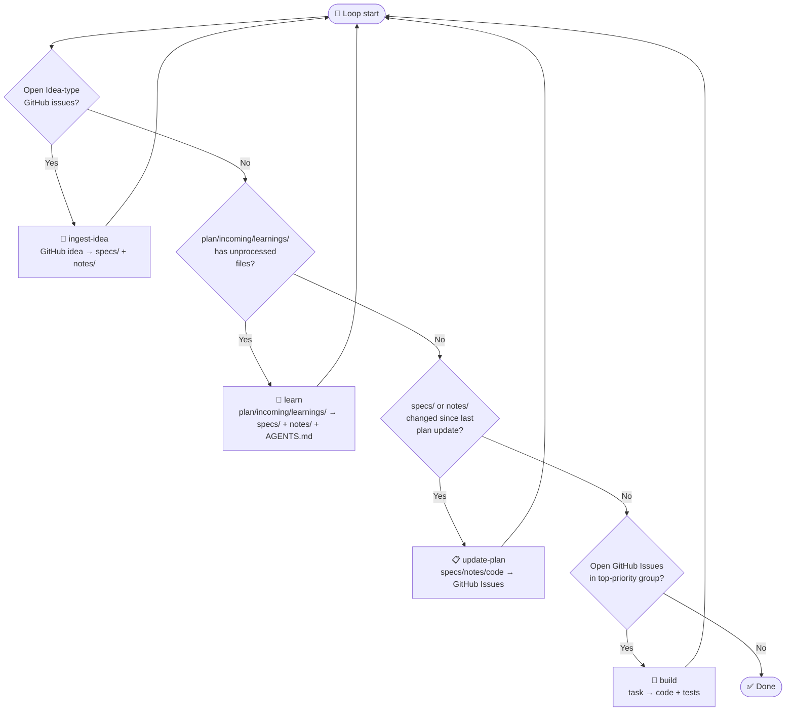

**Archived:** 2026-09-17
**Reason:** (a,e) keyed on retired BUILD_LEARNINGS.md / ingest-idea
**Superseded by:** specs/build-workflow.yaml

---

## Priority-Interrupt Loop

The pipeline runs as a loop. On each iteration, the agent checks trigger
conditions in priority order and runs the first matching skill. After the
skill completes, the loop restarts — higher-priority skills always preempt
lower-priority ones.

---
