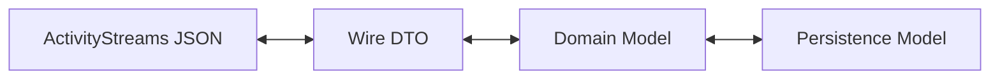

**Archived:** 2026-09-17
**Reason:** (a,b) captured in ADR-0017 and delivered
**Superseded by:** docs/adr/0017-domain-wire-object-separation.md

---

## The Problem

The current `VulnerabilityCase` model subclasses an ActivityStreams object,
collapsing three distinct concerns into one:

- **Wire representation** — ActivityStreams JSON exchanged between Participants
- **Internal domain model** — objects used for behavior logic and persistence
- **Persistence model** — optimized storage structures for the DataLayer

This coupling creates several concrete issues:

- `case_status` and `participant_status` are conceptually **append-only event
  histories**, but are modeled as singular or ambiguously-typed fields.
- `notes` is intended to be append-only but lacks explicit append semantics.
- ActivityStreams `Collection` objects and `Link` references do not map cleanly
  to runtime lists or embedded objects.
- The persistence layer (document-oriented NoSQL) would naturally store lists
  of IDs or embedded sub-documents rather than ActivityStreams-shaped objects.

## Architectural Direction

The correct long-term design introduces a **translation boundary** between
three layers:

## Migration Scoping Lesson from #699 Decomposition

The #699 migration surfaced that moving domain objects from `wire/` to `core/`
is a chained effort, not a single edit. The stable rule for the separation is:

- Reference-wrapper patterns (`FooRef`, ref-or-inline polymorphism) are
  wire-layer concerns.
- Core domain fields hold full typed objects.
- Rehydration happens through the DataLayer on read.
- Wire projection code translates between full-object core fields and wire
  ref-or-inline serialization at the boundary.

This aligns with ADR-0017 and avoids reintroducing wire-polymorphism unions
into domain models.

### 1. Wire Model (Transport Layer)

- ActivityStreams-compliant JSON objects
- `Collection` / `Link` usage per the AS2 vocabulary
- Federated message payload semantics
- Serialized and deserialized at the inbox/outbox boundary

### 2. Domain Model (Core Logic Layer)

- Behavior-tree-facing objects
- Append-only event log structures (case status history,
  participant status history, notes)
- Enforced invariants and business constraints
- Independent of transport format

### 3. Persistence Model (Storage Layer)

- Optimized for document / object storage (TinyDB, future NoSQL)
- No assumption of relational joins
- Efficient append and replay operations
- Lists of IDs or embedded sub-documents as appropriate

## Design Implications

### Treat Status and Notes as Event Logs

Fields such as `case_status`, `participant_status`, and `notes` SHOULD be
modeled internally as **append-only sequences of typed events**, each with
its own identity and timestamp. The current implementation stores these as
lists; the rename from `case_status` → `case_statuses` (tracked in
`specs/case-management.yaml` CM-03-006) is the first step toward making
append-only semantics explicit.

ActivityStreams `Collection` then becomes a projection of this log for
transport only.

### Avoid Letting ActivityStreams Drive Core Data Shapes

ActivityStreams is a **serialization vocabulary**, not a domain model. If
wire-format concerns continue to dictate object shape:

- Internal refactors become expensive.
- Behavior-tree logic inherits wire-format artifacts.
- Persistence optimizations are constrained by federation concerns.

Instead, define domain objects around Vultron semantics (Case, Report,
ParticipantState, EmbargoState) and provide explicit adapters to and from
ActivityStreams.

### Plan for Independent Evolution

Introducing a translation boundary allows:

- Freedom to revise internal representations without breaking wire compatibility
- Ability to version wire formats separately from runtime structures
- Cleaner enforcement of invariants at the domain layer
